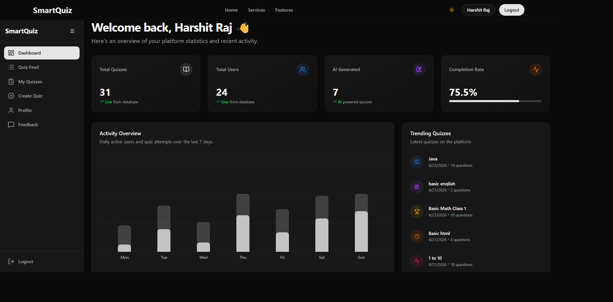
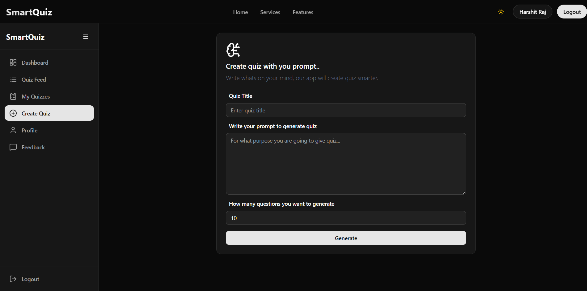
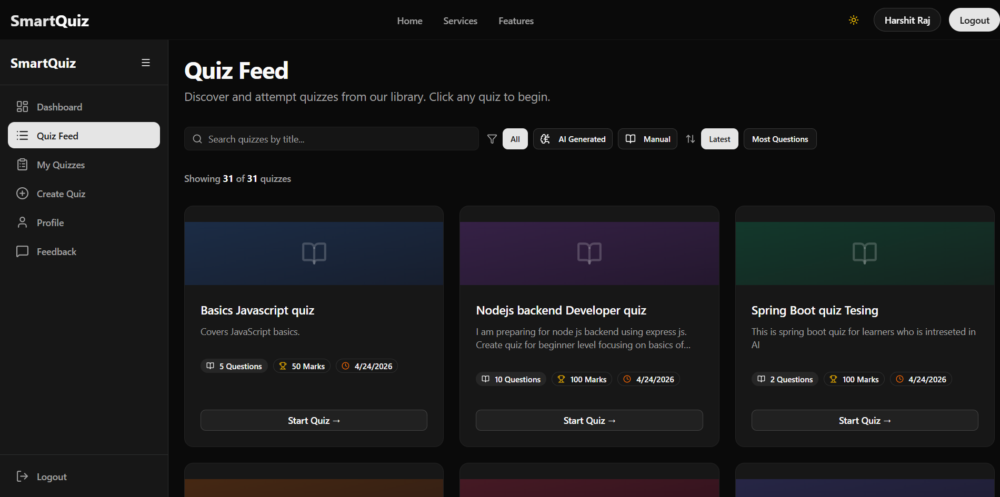
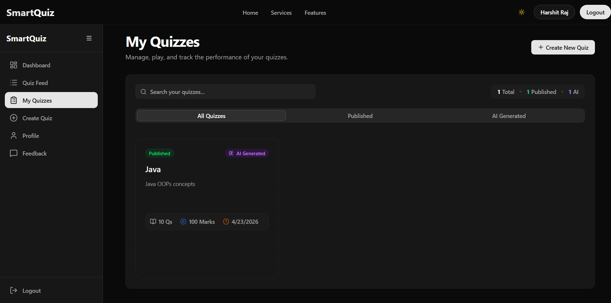
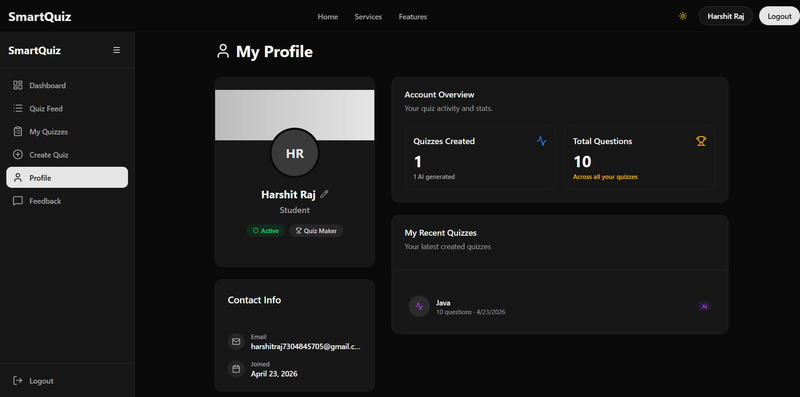
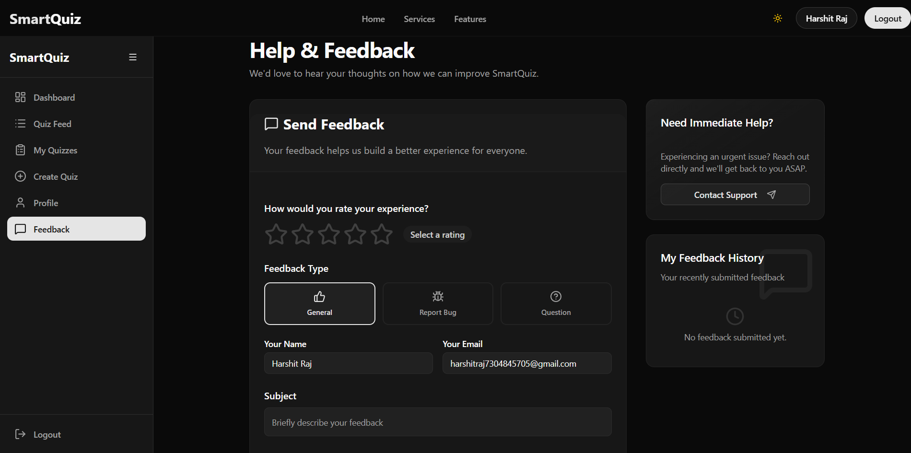
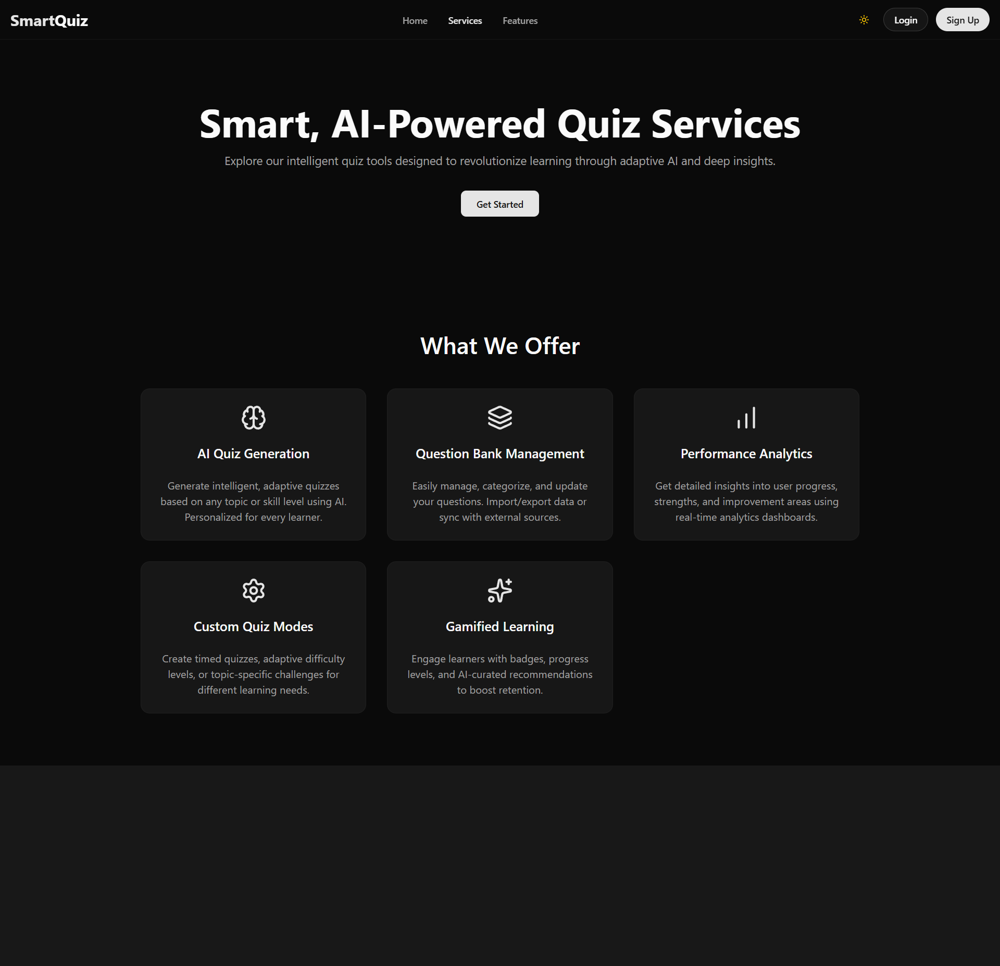
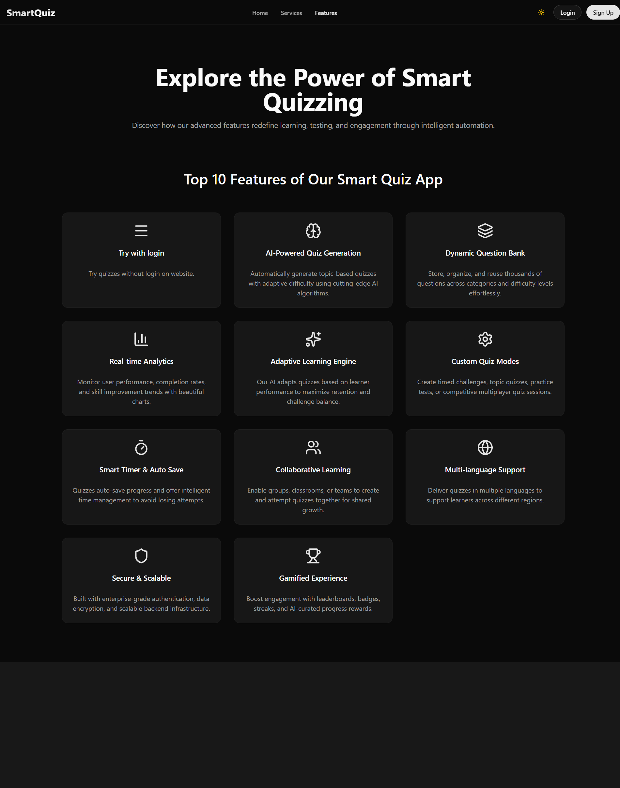
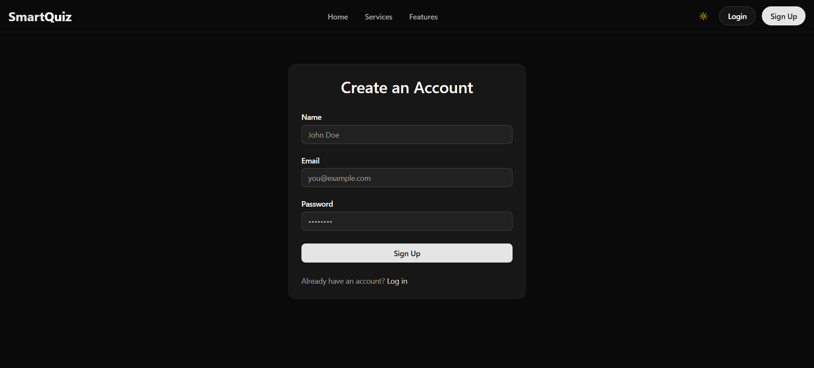

# 🧠 SmartQuiz

An AI-powered Smart Quiz Platform built using the MERN Stack.
SmartQuiz helps users create, manage, and attempt quizzes with intelligent AI-generated questions, analytics dashboards, and modern UI experience.

---

# 🚀 Features

✅ AI Quiz Generation
✅ Dynamic Quiz Feed
✅ Dashboard Analytics
✅ Quiz Management System
✅ User Authentication
✅ Profile Management
✅ Feedback System
✅ Search & Filter Quizzes
✅ Responsive UI
✅ Real-time Statistics
✅ Quiz Performance Tracking
✅ MERN Stack Architecture

---

# 📌 About The Project

SmartQuiz is a full-stack intelligent quiz application designed for students, learners, and educators.

The platform allows users to:

- Create quizzes manually or using AI
- Browse quizzes from the quiz feed
- Track quiz performance using dashboards
- Manage personal quizzes
- Analyze statistics and completion rates
- Give feedback and interact with the system
- Access responsive and modern UI

This project focuses on AI integration, modern UI/UX, analytics visualization, and scalable MERN architecture.

---

# 🛠️ Tech Stack

## Frontend

- React.js
- Tailwind CSS
- Axios
- React Router
- Chart.js
- Flowbite React

## Backend

- Node.js
- Express.js
- MongoDB
- JWT Authentication
- REST API

## Tools & Platforms

- Git & GitHub
- VS Code
- Postman
- Render
- Vercel

---

# 📸 Project Screenshots

## 🏠 Home Page


---

## 📊 Dashboard



---

## 🤖 Create Quiz



---

## 📚 Quiz Feed



---

## 📝 My Quizzes



---

## 👤 Profile Page



---

## 💬 Feedback Page



---

## ⚙️ Services Page



---

## ✨ Features Page



---

## 🔐 Login Page


---

## 🆕 Signup Page



---

# ⚙️ Installation & Setup

## Clone Repository

```bash
git clone https://github.com/your-username/smartquiz.git
```

---

## Frontend Setup

```bash
cd frontend
npm install
npm run dev
```

---

## Backend Setup

```bash
cd backend
npm install
npm start
```

---

# 📂 Project Structure

```bash
smartquiz/
│
├── frontend/
│
├── backend/
│
├── screenshots/
│
└── README.md
```

---

# 🌐 Environment Variables

## Backend `.env`

```env
PORT=5000
MONGO_URI=your_mongodb_connection
JWT_SECRET=your_secret_key
```

---

# 🚀 Deployment

## Frontend Deployment

- Vercel

## Backend Deployment

- Render

---

# 👨‍💻 About Me

Hi, I'm Harshit Raj — a passionate Full Stack Developer focused on building modern, responsive, and AI-powered web applications.

I enjoy building real-world MERN stack projects and continuously improving my development skills through hands-on learning and innovation.

---

# 🌐 Connect With Me

📧 Email: harshitraj7304@gmail.com
🔗 LinkedIn: https://www.linkedin.com/in/harshit-raj-7304/
💻 GitHub: https://github.com/harshitraj7304

---

# ⭐ Support

If you like this project, give it a ⭐ on GitHub.

---

# 📜 License

This project is made for learning and portfolio purposes.
